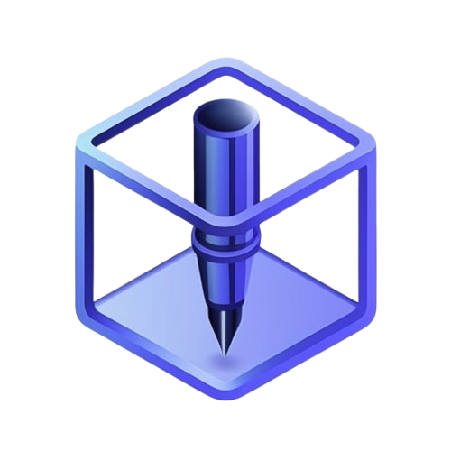
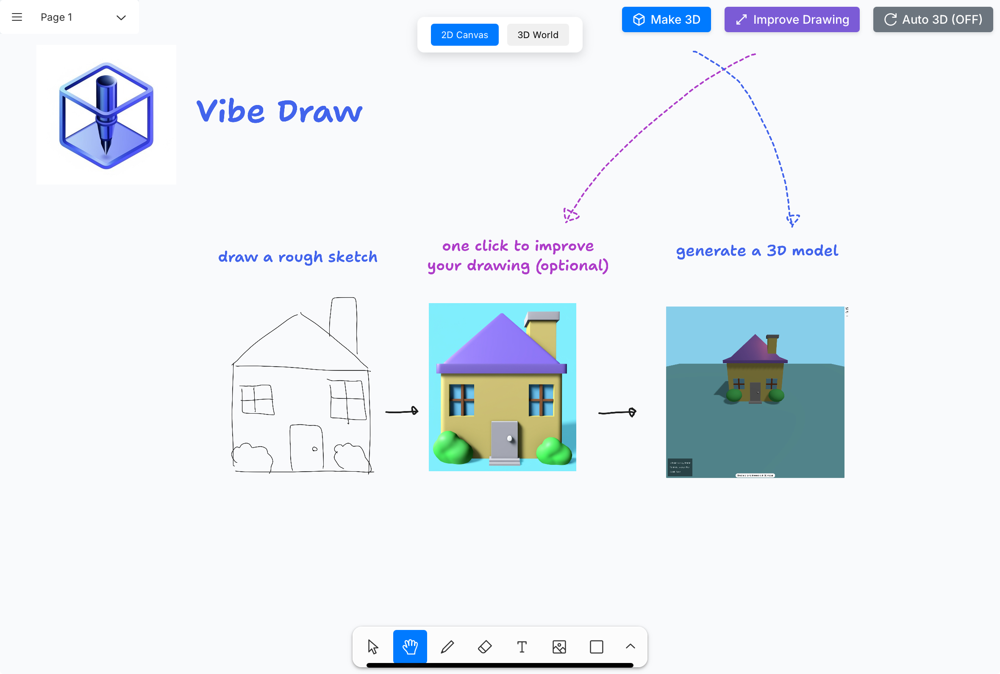
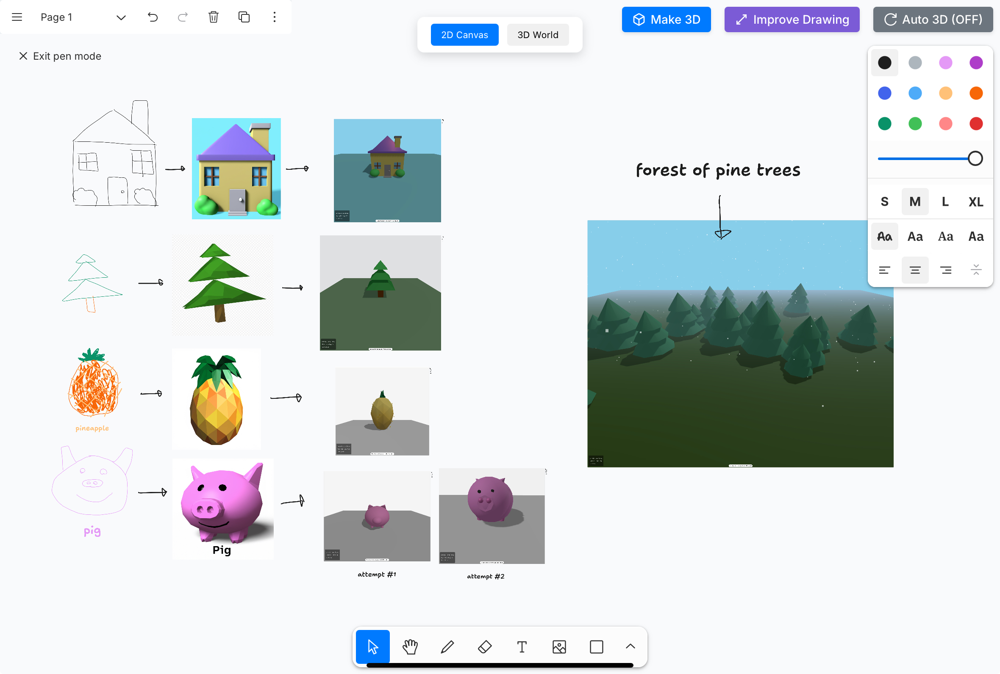
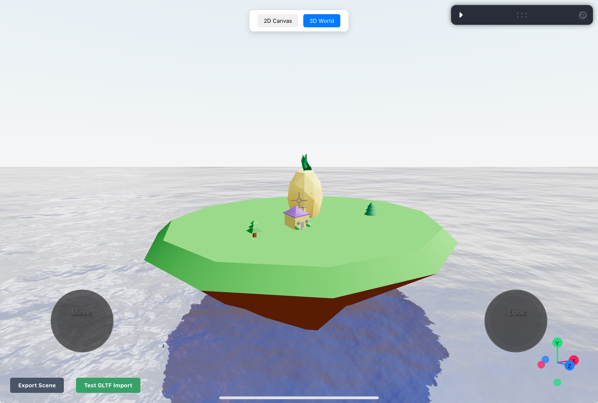

<div align="center">
    
</div>
<h1 align="center">
    Vibe Draw - Cursor for 3D Modeling
</h1>
<p align="center">
   turn your roughest sketches into stunning 3D worlds by vibe drawing
</p>

https://github.com/user-attachments/assets/a3c804e1-b208-4855-b285-d571bedf1f3e







## How It Works

1. **Sketch**: Draw freely on the 2D canvas
2. **Enhance**: Use the "Improve Drawing" button to refine sketches into detailed, polished drawings
3. **Transform**: Click "Make 3D" to convert your drawing into a 3D model
4. **Build**: Add your 3D models to the world by switching to the 3D World tab
5. **Iterate**: Edit and refine your 3D models by sketching or by writing a text prompt
6. **Export**: Export your 3D world with 1 click in a standard format (.glTF) to integrate with your pre-existing tooling 

## Quick Start

### Prerequisites

- Node.js 18+
- Python 3.10+
- API keys for Claude, Gemini, Groq, and PiAPI

### Frontend Setup

```bash
cd frontend

npm install

npm run dev
```

### Backend Setup

```bash
cd backend

# remember to add api keys
cp .env.example .env

docker compose up
```

## Architecture

### Frontend

- **Next.js & React**: Responsive, user-friendly UI
- **Three.js**: Rendering interactive 3D models
- **TLDraw**: Powerful 2D drawing canvas
- **Zustand**: State management

### Backend

- **FastAPI**: High-performance API framework
- **Celery**: Asynchronous task queue for AI operations
- **Redis**: Pub/Sub for real-time updates and task result storage
- **SSE (Server-Sent Events)**: Real-time progress updates

## Inspiration

Creativity is often constrained by technical skills or complex software. Vibe Draw makes 3D modeling accessible to anyone regardless of artistic or technical abilities.

Our goal is to empower people to freely express their imagination and bring their ideas effortlessly into 3D worlds.

## License

[AGPL](LICENSE)
